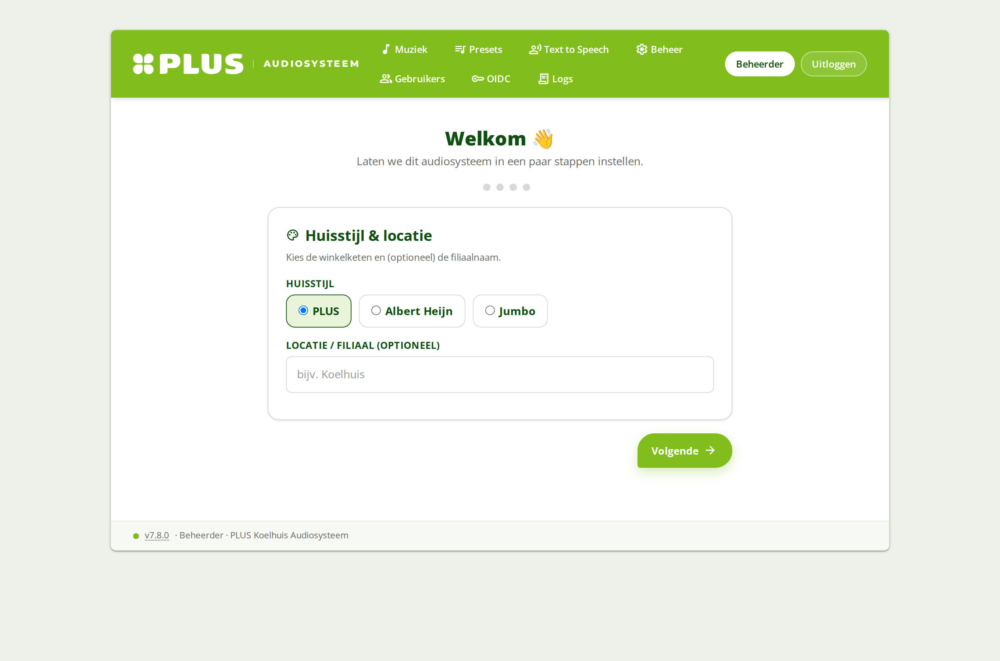
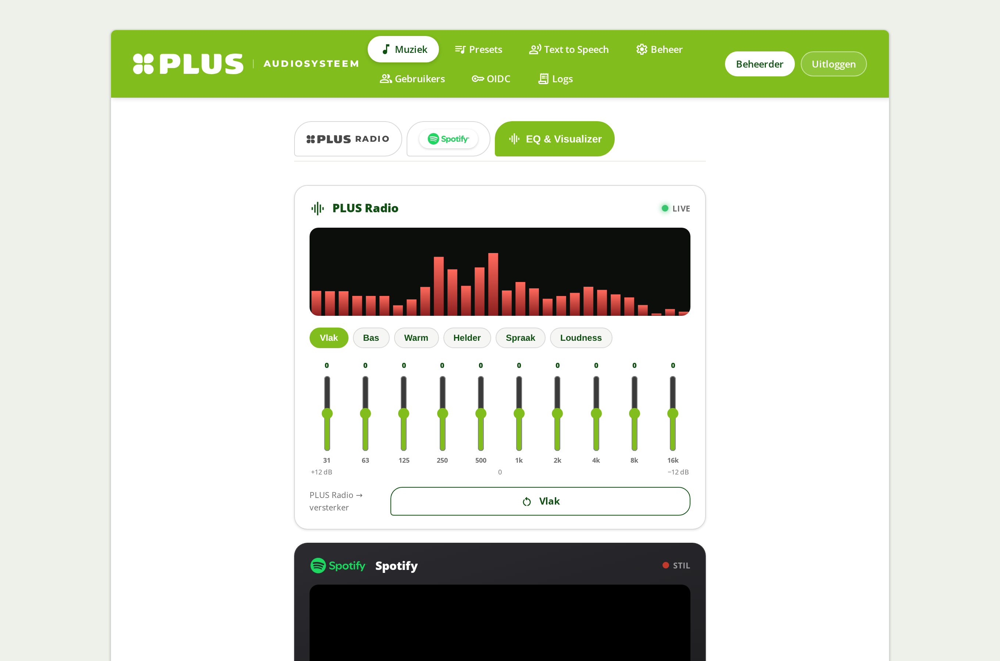
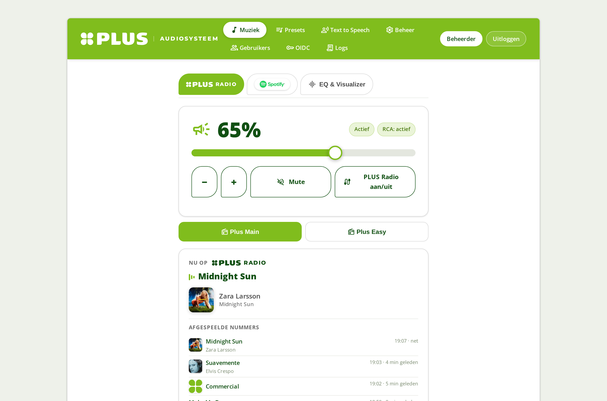
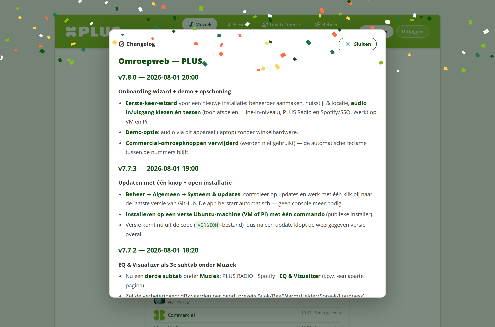

# PLUS Audiosysteem (Omroepweb)

Een web-gestuurd **in-store audiosysteem** voor een supermarkt: winkelmuziek (PLUS Radio),
Spotify, presets/jingles, Text-to-Speech-omroepen, automatische reclame-afhandeling, een
10-bands EQ met visualizer, gebruikersbeheer met fijnmazige rechten, en koppelingen met
Icecast, TuneIn, Home Assistant en 3CX.

> White-label: draait ook in andere huisstijlen (PLUS / Jumbo / Albert Heijn) via
> **Beheer → Huisstijl**.

---

## Snelle installatie

**Nieuwe installatie op een verse Ubuntu (VM of Raspberry Pi) — één commando:**

```bash
curl -fsSL https://raw.githubusercontent.com/LarsPeter1230/plus-audiosysteem/main/install.sh | bash
```

Dit kloont de repo naar `~/plus-audiosysteem`, installeert alles (systeempakketten, venv,
service, het `omroepweb-update`-commando) en start de app op poort **5050**. Open daarna de
web-UI en doorloop de **onboarding** (admin, huisstijl, audio testen, PLUS Radio, Spotify/SSO).

> Draai het commando als een normale gebruiker met sudo-rechten (niet als root).

**Updaten** — na de eerste install hoef je nooit meer de console in:

- In de web-UI: **Beheer → Algemeen → Systeem & updates → Nu bijwerken**, of
- op de commandline: `omroepweb-update`

---

## Screenshots

| Onboarding-wizard | Muziek + EQ & Visualizer |
|---|---|
|  |  |

| Muziek (PLUS Radio + Spotify) | Inloggen |
|---|---|
|  |  |

## Functies (kort)

- **Muziek-pagina** met 3 subtabs: **PLUS Radio** (winkelmuziek van een Streamit Lisa-streamer,
  now-playing via telnet + Shazam-verrijking), **Spotify** (volwaardige speler: zoeken, afspelen,
  wachtrij, historie via go-librespot + Web API), en **EQ & Visualizer**.
- **EQ & Visualizer**: 10-bands EQ per bron (Spotify via `alsaequal`, PLUS Radio via een
  ffmpeg-filter) met dB-waarden en presets; live visualizer (PLUS Radio = echt spectrum van de
  line-in, server-side FFT; Spotify = meebewegende animatie).
- **Presets / jingles** en **Text-to-Speech**-omroepen met in-/uitfaden van de muziek.
- **Reclame-automatiek**: detecteert reclames op PLUS Radio en speelt ze netjes **tussen de
  nummers** over Spotify; laatste opnames zijn te downloaden.
- **Automatiseringen** (Home-Assistant-stijl: triggers, voorwaarden, acties, webhooks).
- **Gebruikers & rechten**: lokale login of OIDC/SSO; fijnmazige volume-/bedien-rechten
  (bijv. servicebalie = alleen kijken).
- **Koppelingen**: Icecast-metadata, TuneIn now-playing, 3CX- en Home-Assistant-webhooks.

---

## Architectuur

- **`app.py`** — de complete Flask-applicatie (routes, audio-aansturing, integraties).
- **`templates_py.py`** — alle pagina's als Python-strings (Jinja); `static/` + `templates/`
  bevatten aanvullende assets.
- **Runtime-data** staat **buiten de repo** in `~/omroepweb/` (settings, presets, logs,
  geschiedenis, secrets). Wordt automatisch aangemaakt/aangevuld.
- **Audio-routing (ALSA, `system/asound.conf`)**: line-in (PLUS Radio) → `bg`; Spotify
  (go-librespot) → `spot` (via `eq_spot` alsaequal) → dac; presets/TTS → `pst`; alles mixt via
  `dmix` naar de geluidskaart → versterker.
- **Services** (`system/*.tmpl`): `omroepweb` (de app), `go-librespot` (Spotify Connect),
  `rca-stream` (line-in → Icecast).

---

## Secrets

Secrets staan **nooit in de repo**. Ze komen uit `omroepweb.env` (kopie van
`system/omroepweb.env.example`, gekoppeld als `EnvironmentFile` aan de service):

| Variabele | Betekenis |
|---|---|
| `SECRET_KEY` | Flask session-secret (lange willekeurige string) |
| `ADMIN_PIN` | PIN om de eerste admin aan te maken/herstellen |
| `OIDC_CLIENT_ID/SECRET/DISCOVERY_URL/REDIRECT_URI` | OIDC/SSO (optioneel; leeg = lokale login) |
| `PI_LOCAL_GLR` | `1` = Spotify lokaal op de VM (standaard), `0` = oude Pi-modus |

Verder (runtime, in `~/omroepweb/`, buiten de repo): `secret_key`, `spotify_oauth.json`
(Spotify Web API-koppeling), `oidc_config.json`, en de go-librespot-credentials in
`~/.config/go-librespot/state.json`.

---

## Handmatige onderdelen

Deze zijn hardware-/omgeving-specifiek en vallen buiten `install.sh`:

- **Geluidskaart + `asound.conf`**: kopieer `system/asound.conf` naar `/etc/asound.conf`
  (met backup). Vereist `libasound2-plugin-equal` + `caps` (LADSPA) voor de Spotify-EQ.
- **Spotify Connect**: plaats de `go-librespot`-binary in `~/go-librespot/`, gebruik
  `system/go-librespot.config.yml` als basis, log éénmalig in (interactive), en installeer de
  service uit `system/go-librespot.service.tmpl`.
- **Online stream**: Icecast2 + de `rca-stream`-service (`system/rca-stream.service.tmpl`,
  vul je eigen Icecast-wachtwoord/mount in).
- **PLUS Radio-hardware**: een Streamit Lisa-streamer met telnet aan (poort 23); stel het IP in
  onder **Beheer → PLUS Radio**.
- **Reverse proxy**: nginx voor HTTPS + het Spotify OAuth-callback-pad.

---

## Live demo

Een **statische, interactieve demo** van de interface (laatste versie, met voorbeelddata)
draait op GitHub Pages — geen installatie nodig:

**https://larspeter1230.github.io/plus-audiosysteem/**

> Toont de volledige UI (Muziek, EQ & Visualizer, onboarding); geluid werkt niet in de
> browser-demo. Bron + generator staan in [`demo/`](demo/) en op de `gh-pages`-branch.

## Demo-modus

De app kan **zonder winkelhardware** draaien om te demonstreren of te testen (op een
laptop, VM of losse server). Zet in de onboarding het vinkje **"Demo / test op deze
computer"** aan, of draai met de env-variabele:

```bash
OMROEPWEB_DATA=~/omroepweb-demo OMROEPWEB_PORT=5051 venv/bin/python app.py
```

In demo-modus wordt **geen echte audio-hardware of Spotify** aangestuurd, zodat een demo
naast een productie-installatie kan draaien. De volledige interface (onboarding, EQ &
Visualizer, Muziek, Beheer) werkt 1-op-1; geluid is in een browser-demo beperkt (de app
stuurt normaal server-audio aan).

## Updaten & releases

- **`omroepweb-update`** haalt de laatste code van GitHub (`git reset --hard origin/main`),
  werkt de Python-dependencies bij en herstart de service.
- Versies worden als **GitHub Releases** (git-tags, bijv. `v7.7.x`) gepubliceerd; de in-app
  changelog (Beheer → Changelog) toont wat er per versie is veranderd.

---

## Licentie / gebruik

Interne applicatie. De winkelmuziek zelf (Streamit/DDJ) is gelicentieerd en wordt **niet**
meegeleverd of gehost door deze app.
